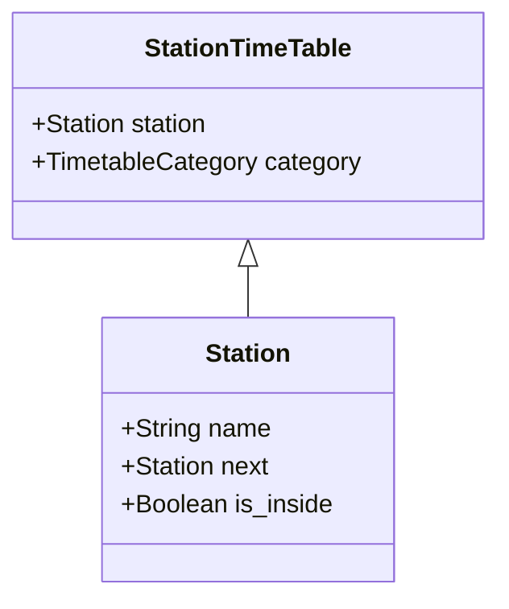

```mermaid
classDiagram
    class Station
    Station : +String name
    Station : +Station next
    Station : +Boolean is_inside

    class StationTimeTable
    StationTimeTable <|-- Station
    StationTimeTable : +Station station
    StationTimeTable : +TimetableCategory category 

```
TimeTableCategory = ["","",""] のUnion型である。
